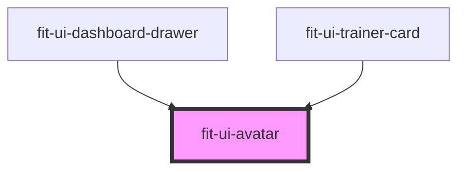

# fit-ui-avatar

<!-- Auto Generated Below -->

## Properties

| Property | Attribute | Description                        | Type     | Default     |
| -------- | --------- | ---------------------------------- | -------- | ----------- |
| `src`    | `src`     | The source of the image to render. | `string` | `undefined` |

## Dependencies

### Used by

 - [fit-ui-dashboard-drawer](../dashboard/dashboard-drawer)
 - [fit-ui-trainer-card](../trainer/trainer-card)

### Graph

----------------------------------------------

*Built with [StencilJS](https://stenciljs.com/)*
