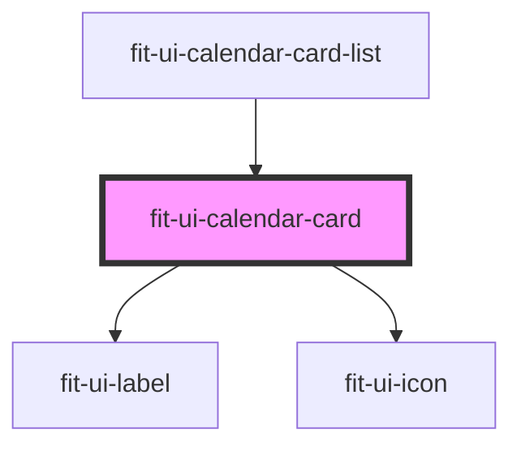

# fit-ui-calendar-card

<!-- Auto Generated Below -->

## Properties

| Property     | Attribute    | Description                            | Type                                                                                                                   | Default     |
| ------------ | ------------ | -------------------------------------- | ---------------------------------------------------------------------------------------------------------------------- | ----------- |
| `color`      | `color`      | The color of the indicator on the card | `"black" \| "cyan" \| "danger" \| "gray" \| "green" \| "light-gray" \| "primary" \| "success" \| "warning" \| "white"` | `'primary'` |
| `endTime`    | `end-time`   | The display format for the end time.   | `string`                                                                                                               | `undefined` |
| `heading`    | `heading`    | The heading of the calendar card       | `string`                                                                                                               | `undefined` |
| `startTime`  | `start-time` | The display format for the start time. | `string`                                                                                                               | `undefined` |
| `subheading` | `subheading` | The sub heading of the calendar card   | `string`                                                                                                               | `undefined` |

## Events

| Event  | Description | Type               |
| ------ | ----------- | ------------------ |
| `more` |             | `CustomEvent<any>` |

## Dependencies

### Used by

 - [fit-ui-calendar-card-list](../calendar-card-list)

### Depends on

- [fit-ui-label](../../typography/label)
- [fit-ui-icon](../../icon)

### Graph

----------------------------------------------

*Built with [StencilJS](https://stenciljs.com/)*
