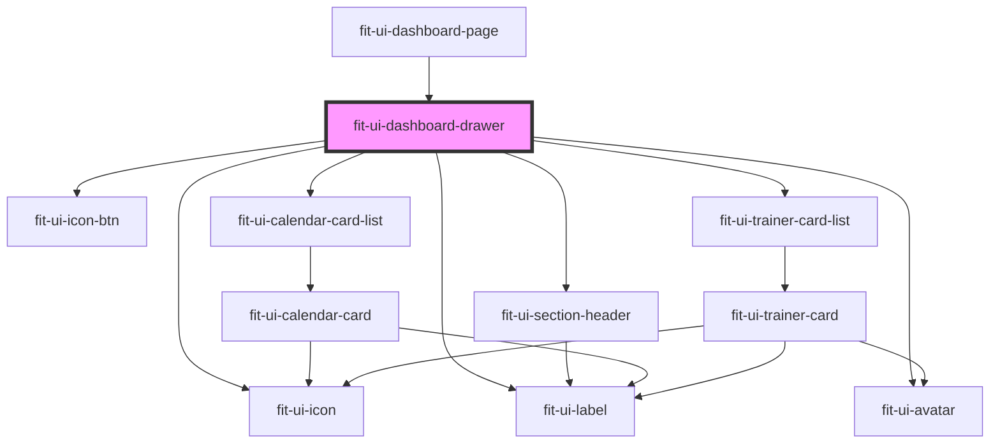

# fit-ui-dashboard-drawer

<!-- Auto Generated Below -->

## Dependencies

### Used by

 - [fit-ui-dashboard-page](../../pages/dashboard)

### Depends on

- [fit-ui-icon-btn](../../icon-btn)
- [fit-ui-icon](../../icon)
- [fit-ui-label](../../typography/label)
- [fit-ui-avatar](../../avatar)
- [fit-ui-section-header](../../typography/section-header)
- [fit-ui-calendar-card-list](../../calendar/calendar-card-list)
- [fit-ui-trainer-card-list](../../trainer/trainer-card-list)

### Graph

----------------------------------------------

*Built with [StencilJS](https://stenciljs.com/)*
