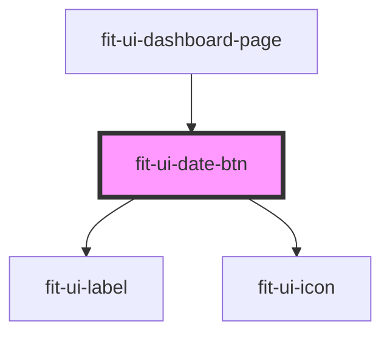

# fit-ui-date-btn

<!-- Auto Generated Below -->

## Properties

| Property | Attribute | Description | Type   | Default      |
| -------- | --------- | ----------- | ------ | ------------ |
| `value`  | --        |             | `Date` | `new Date()` |

## Dependencies

### Used by

 - [fit-ui-dashboard-page](../pages/dashboard)

### Depends on

- [fit-ui-label](../typography/label)
- [fit-ui-icon](../icon)

### Graph

----------------------------------------------

*Built with [StencilJS](https://stenciljs.com/)*
