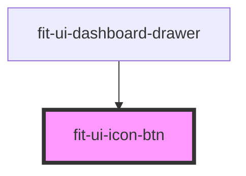

# fit-ui-icon-btn

<!-- Auto Generated Below -->

## Properties

| Property | Attribute | Description                                   | Type      | Default     |
| -------- | --------- | --------------------------------------------- | --------- | ----------- |
| `active` | `active`  | `true` if the active indicator should display | `boolean` | `undefined` |

## Dependencies

### Used by

 - [fit-ui-dashboard-drawer](../dashboard/dashboard-drawer)

### Graph

----------------------------------------------

*Built with [StencilJS](https://stenciljs.com/)*
