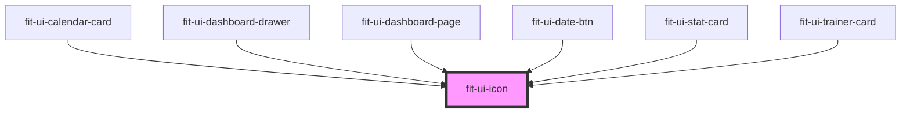

# ion-icon

<!-- Auto Generated Below -->

## Properties

| Property    | Attribute    | Description                                                                                     | Type                                                                                                                   | Default     |
| ----------- | ------------ | ----------------------------------------------------------------------------------------------- | ---------------------------------------------------------------------------------------------------------------------- | ----------- |
| `ariaLabel` | `aria-label` | Specifies the label to use for accessibility. Defaults to the icon name.                        | `string`                                                                                                               | `undefined` |
| `color`     | `color`      |                                                                                                 | `"black" \| "cyan" \| "danger" \| "gray" \| "green" \| "light-gray" \| "primary" \| "success" \| "warning" \| "white"` | `undefined` |
| `lazy`      | `lazy`       | If enabled, ion-icon will be loaded lazily when it's visible in the viewport. Default, `false`. | `boolean`                                                                                                              | `false`     |
| `name`      | `name`       | Specifies which icon to use from the built-in set of icons.                                     | `string`                                                                                                               | `undefined` |
| `size`      | `size`       | The size of the icon. Available options are: `"small"` and `"large"`.                           | `string`                                                                                                               | `undefined` |

## Dependencies

### Used by

 - [fit-ui-calendar-card](../calendar/calendar-card)
 - [fit-ui-dashboard-drawer](../dashboard/dashboard-drawer)
 - [fit-ui-dashboard-page](../pages/dashboard)
 - [fit-ui-date-btn](../date-btn)
 - [fit-ui-stat-card](../stat-card)
 - [fit-ui-trainer-card](../trainer/trainer-card)

### Graph

----------------------------------------------

*Built with [StencilJS](https://stenciljs.com/)*
