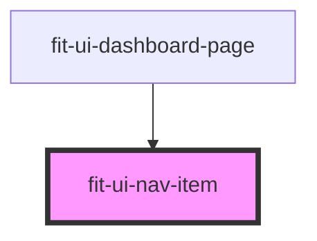

# fit-ui-nav-item

<!-- Auto Generated Below -->

## Properties

| Property | Attribute | Description                      | Type      | Default     |
| -------- | --------- | -------------------------------- | --------- | ----------- |
| `active` | `active`  | `true` if the nav item is active | `boolean` | `undefined` |

## Dependencies

### Used by

 - [fit-ui-dashboard-page](../../pages/dashboard)

### Graph

----------------------------------------------

*Built with [StencilJS](https://stenciljs.com/)*
