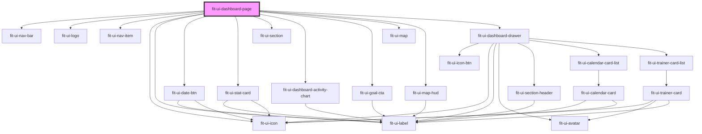

# fit-ui-dashboard-page

<!-- Auto Generated Below -->

## Dependencies

### Depends on

- [fit-ui-nav-bar](../../nav/nav-bar)
- [fit-ui-logo](../../typography/logo)
- [fit-ui-nav-item](../../nav/nav-item)
- [fit-ui-icon](../../icon)
- [fit-ui-label](../../typography/label)
- [fit-ui-date-btn](../../date-btn)
- [fit-ui-stat-card](../../stat-card)
- [fit-ui-section](../../section)
- [fit-ui-dashboard-activity-chart](../../dashboard/dashboard-activity-chart)
- [fit-ui-goal-cta](../../goal-cta)
- [fit-ui-map](../../map/map)
- [fit-ui-map-hud](../../map/map-hud)
- [fit-ui-dashboard-drawer](../../dashboard/dashboard-drawer)

### Graph

----------------------------------------------

*Built with [StencilJS](https://stenciljs.com/)*
