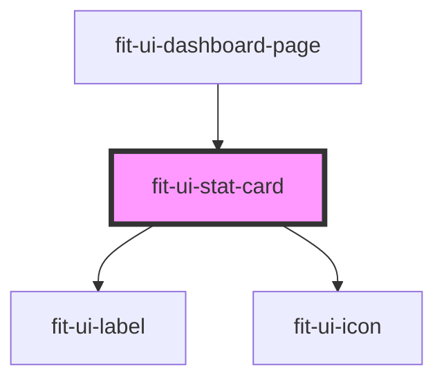

# fit-ui-stat-card

<!-- Auto Generated Below -->

## Properties

| Property       | Attribute       | Description                                       | Type                                                                                                                   | Default     |
| -------------- | --------------- | ------------------------------------------------- | ---------------------------------------------------------------------------------------------------------------------- | ----------- |
| `color`        | `color`         | The color of the statistic fill.                  | `"black" \| "cyan" \| "danger" \| "gray" \| "green" \| "light-gray" \| "primary" \| "success" \| "warning" \| "white"` | `undefined` |
| `heading`      | `heading`       | The displayed heading of the statistic            | `string`                                                                                                               | `undefined` |
| `headingColor` | `heading-color` | The color of the heading.                         | `"black" \| "cyan" \| "danger" \| "gray" \| "green" \| "light-gray" \| "primary" \| "success" \| "warning" \| "white"` | `undefined` |
| `icon`         | `icon`          | The name of the icon to display.                  | `string`                                                                                                               | `undefined` |
| `percent`      | `percent`       | The percentage to fill the statistic.             | `number \| string`                                                                                                     | `undefined` |
| `unit`         | `unit`          | The unit of measurement. Used as a display label. | `string`                                                                                                               | `'BPM'`     |
| `value`        | `value`         | The value of the statistic being displayed.       | `number \| string`                                                                                                     | `undefined` |

## Dependencies

### Used by

 - [fit-ui-dashboard-page](../pages/dashboard)

### Depends on

- [fit-ui-label](../typography/label)
- [fit-ui-icon](../icon)

### Graph

----------------------------------------------

*Built with [StencilJS](https://stenciljs.com/)*
