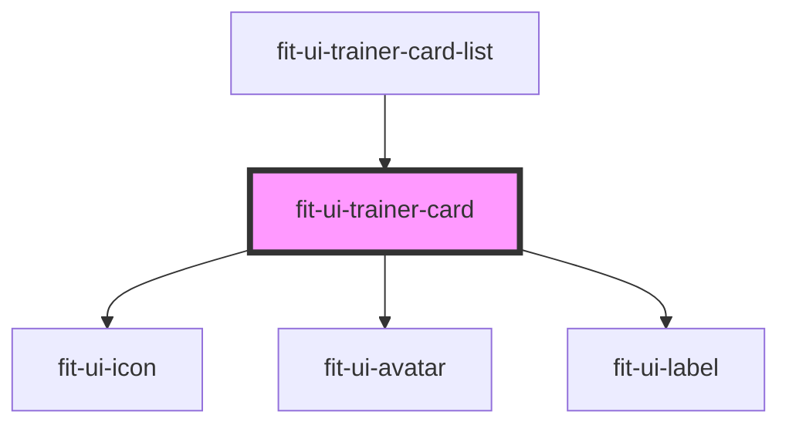

# fit-ui-trainer-card

<!-- Auto Generated Below -->

## Properties

| Property        | Attribute        | Description                                     | Type      | Default     |
| --------------- | ---------------- | ----------------------------------------------- | --------- | ----------- |
| `active`        | `active`         | `true` if the trainer is active (online)        | `boolean` | `true`      |
| `category`      | `category`       | The category of fitness the trainer focuses on. | `string`  | `undefined` |
| `facebookUrl`   | `facebook-url`   | The facebook url of the trainer                 | `string`  | `undefined` |
| `name`          | `name`           | The name of the trainer.                        | `string`  | `undefined` |
| `rating`        | `rating`         | The rating of the trainer.                      | `number`  | `undefined` |
| `src`           | `src`            | The image source of the trainer's photo.        | `string`  | `undefined` |
| `twitterHandle` | `twitter-handle` | The twitter handle of the trainer               | `string`  | `undefined` |

## Dependencies

### Used by

 - [fit-ui-trainer-card-list](../trainer-card-list)

### Depends on

- [fit-ui-icon](../../icon)
- [fit-ui-avatar](../../avatar)
- [fit-ui-label](../../typography/label)

### Graph

----------------------------------------------

*Built with [StencilJS](https://stenciljs.com/)*
