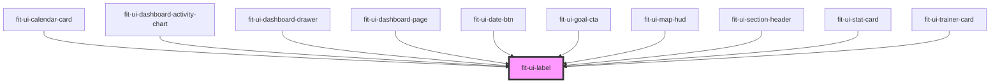

# hive-ui-label

<!-- Auto Generated Below -->

## Properties

| Property     | Attribute    | Description                                                                                                           | Type                                                                                                                   | Default     |
| ------------ | ------------ | --------------------------------------------------------------------------------------------------------------------- | ---------------------------------------------------------------------------------------------------------------------- | ----------- |
| `base`       | `base`       |                                                                                                                       | `boolean`                                                                                                              | `undefined` |
| `bold`       | `bold`       |                                                                                                                       | `boolean`                                                                                                              | `undefined` |
| `book`       | `book`       |                                                                                                                       | `boolean`                                                                                                              | `undefined` |
| `capitalize` | `capitalize` |                                                                                                                       | `boolean`                                                                                                              | `undefined` |
| `color`      | `color`      | The primary color of the label. Uses the branded CSS variables that are globally available to the application.        | `"black" \| "cyan" \| "danger" \| "gray" \| "green" \| "light-gray" \| "primary" \| "success" \| "warning" \| "white"` | `undefined` |
| `lg`         | `lg`         |                                                                                                                       | `boolean`                                                                                                              | `undefined` |
| `lowercase`  | `lowercase`  |                                                                                                                       | `boolean`                                                                                                              | `undefined` |
| `maxLines`   | `max-lines`  | The maximum lines to display before truncating the text. Default behavior shows all lines of text with no truncation. | `number`                                                                                                               | `undefined` |
| `medium`     | `medium`     |                                                                                                                       | `boolean`                                                                                                              | `undefined` |
| `semibold`   | `semibold`   |                                                                                                                       | `boolean`                                                                                                              | `undefined` |
| `sm`         | `sm`         |                                                                                                                       | `boolean`                                                                                                              | `undefined` |
| `type`       | `type`       |                                                                                                                       | `"label" \| "text"`                                                                                                    | `'text'`    |
| `uppercase`  | `uppercase`  |                                                                                                                       | `boolean`                                                                                                              | `undefined` |
| `xbold`      | `xbold`      |                                                                                                                       | `boolean`                                                                                                              | `undefined` |
| `xl`         | `xl`         |                                                                                                                       | `boolean`                                                                                                              | `undefined` |
| `xs`         | `xs`         |                                                                                                                       | `boolean`                                                                                                              | `undefined` |
| `xxl`        | `xxl`        |                                                                                                                       | `boolean`                                                                                                              | `undefined` |

## Dependencies

### Used by

 - [fit-ui-calendar-card](../../calendar/calendar-card)
 - [fit-ui-dashboard-activity-chart](../../dashboard/dashboard-activity-chart)
 - [fit-ui-dashboard-drawer](../../dashboard/dashboard-drawer)
 - [fit-ui-dashboard-page](../../pages/dashboard)
 - [fit-ui-date-btn](../../date-btn)
 - [fit-ui-goal-cta](../../goal-cta)
 - [fit-ui-map-hud](../../map/map-hud)
 - [fit-ui-section-header](../section-header)
 - [fit-ui-stat-card](../../stat-card)
 - [fit-ui-trainer-card](../../trainer/trainer-card)

### Graph

----------------------------------------------

*Built with [StencilJS](https://stenciljs.com/)*
